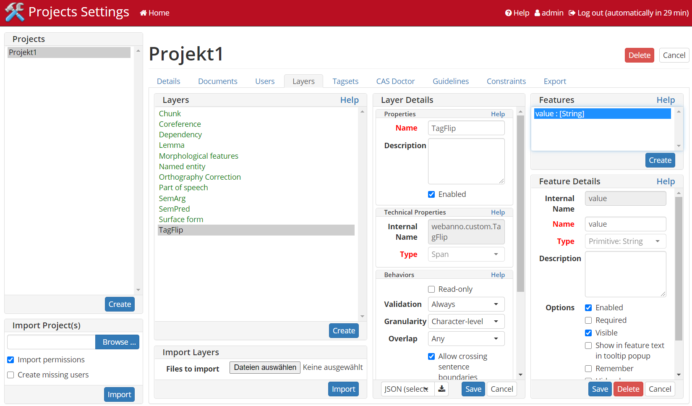

# WebAnno TSV 3.2 Exporter
TagFlip allows Corpora being exported in WebAnno TSV 3.2 format. However, an import
of TagFlip exported data requires some manual adjustments either in the exported
TSV-files (whe you know what you are doing) or in WebAnno itself.

WebAnno's TSV 3.2 files require some declaration to be done in the head section of 
a TSV file.  On default the exporter declares the header as follows:
```
#FORMAT=WebAnno TSV 3.2
#T_SP=webanno.custom.TagFlip|value
```
The first line indicates the file being a TSV file in version 3.2. The second and in
this case more important line gives the information about the Annotation Layer
being used in the TSV file. The [WebAnno documentation](https://webanno.github.io/webanno/releases/3.4.5/docs/user-guide.html#sect_webannotsv) says the following:
>While importing the WebAnno TSV file, the specified headers should be first created in to the running WebAnno project. 
>Otherwise, the importing of the file will not be possible.

What this means is, that before we try to import an TagFlip-exported TSV in WebAnno, we have
to declare the Layer `webanno.custom.TagFlip` containing a feature `value` using the WebAnno Project Settings UI.

The follwing image shows a working declaration of the TagFlip-Layer. Note that the name
of this layer is "TagFlip". WebAnno automatically generates an internal identifier `webanno.custom.TagFlip`
right after inital saving. The feature `value` is declared as primitive type `String`. It's
recommended to attach a Tag-Set to this primitive feature to restrict the Annotation
domain properly as it is restricted in TagFlip. Mapping a Tag-Set can be done there as well. 

